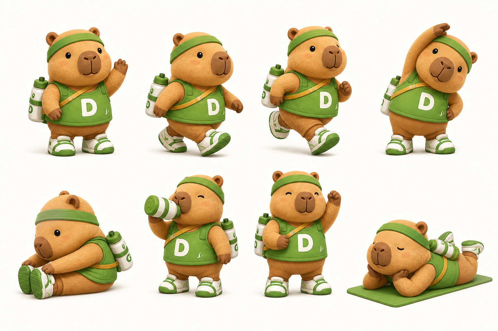
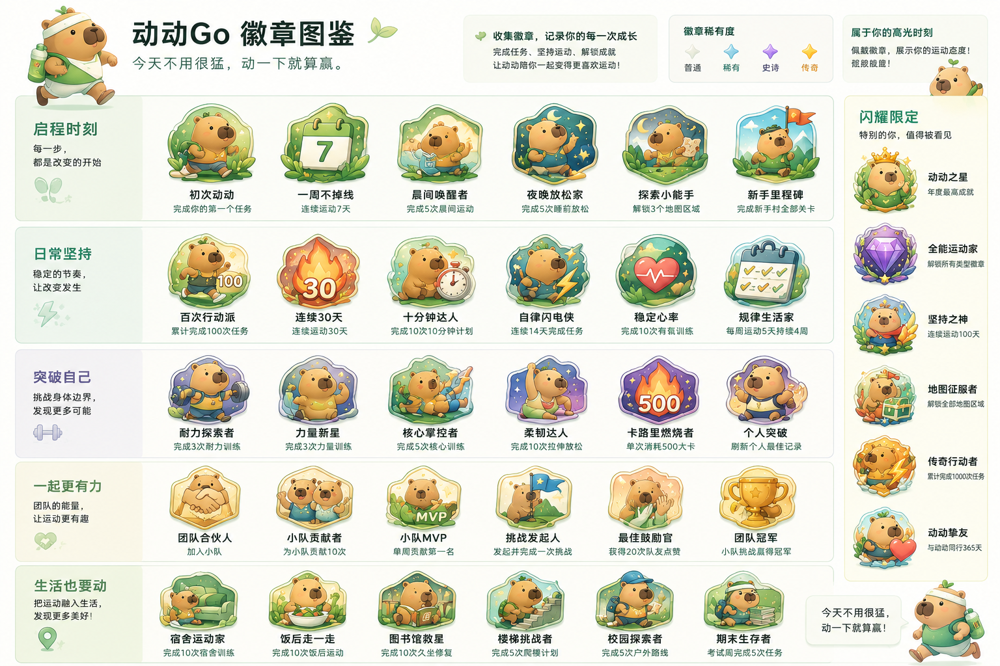

# 动动Go / MoveGo 产品需求文档 PRD

## 1. 产品概述

**产品名称**：动动Go / MoveGo  

**产品形态**：移动端 App 风格 Web Demo / H5 App  

**目标用户**：坚持不下来的大学生  

**吉祥物**：动动，一只戴运动发带、背小水壶、穿运动鞋的小水豚  

**产品口号**：今天不用很猛，动一下就算赢。

**一句话定位**：动动Go 是一款面向大学生的 AI 游戏化运动工具，通过冒险闯关、快练任务、Quest 激励、锦标赛段位和好友社区，帮助用户低压力地提升运动频率。

动动Go 不定位为专业健身 App，而是定位为大学生的 AI 运动搭子和游戏化运动习惯养成工具。产品重点不是让用户高强度训练，而是帮助用户从“偶尔想运动”变成“每周稳定动起来”。

### 1.1 视觉风格与字体

- 视觉风格：移动端优先，轻松、清爽、游戏化，有校园运动感，但不要低幼。
- 色彩方向：绿色作为主色，搭配蓝、黄、浅灰和少量暖色奖励反馈，避免整页单一绿色。
- 字体方向：App UI 使用中文优先字体栈，当前实现为 `HarmonyOS Sans SC`, `PingFang SC`, `Hiragino Sans GB`, `Noto Sans CJK SC`, `Source Han Sans SC`, `Microsoft YaHei UI`, `Microsoft YaHei`, `sans-serif`。
- 字体原则：不要把英文字体放在中文字体前面；标题偏稳重清晰，正文保持亲和易读。

### 1.2 动动吉祥物资产规范

- 素材库：`assets/mascot/`。
- 名字：动动。
- 形象：一只戴绿色运动发带、背小水壶、穿白绿运动鞋的小水豚，穿绿色运动背心，胸前有白色 `D` 标。
- 性格：松弛、温和、陪伴型，不鸡血、不 PUA。
- 口头禅：今天不用很猛，动一下就算赢。
- 视觉风格：圆润、暖棕色毛发、3D 玩具感、轻运动校园感，适合 App 内小尺寸展示。
- 基础形态：头像、默认站立、轻鼓励、步行、慢跑、站姿拉伸、坐姿拉伸、喝水、躺平休息。
- 主要资源：`dongdong-action-sheet.png`、`dongdong-3d-avatar.png`、`dongdong-3d-base.png`、`dongdong-3d-cheer.png`、`dongdong-3d-walk.png`、`dongdong-3d-rest.png`。
- 使用原则：动动像运动搭子，不像教练或监督者；情绪反馈要轻，不制造压力。

---

## 2. 背景与核心问题

大学生普遍知道运动重要，但很难长期坚持。核心问题不是缺少运动知识，而是缺少低门槛启动、即时反馈、同伴监督和持续目标。

主要痛点：

1. 启动成本高：不知道今天做什么，容易觉得运动必须去操场、健身房或换装备。
2. 反馈周期慢：减脂、体能提升、体态改善需要较长时间，短期缺少成就感。
3. 容易中断：考试、熬夜、课程、社团、聚餐都会打断运动节奏。
4. 缺少陪伴：一个人运动缺少监督和动力。
5. 传统健身 App 偏专业：很多产品更适合已有训练习惯的人，对低频用户不够友好。
6. 社交反馈弱：用户完成运动后缺少被看见、被鼓励的反馈。

产品机会：借鉴多邻国的行为养成机制，把 lesson、XP、streak、league、badge 和 mascot 迁移到运动场景，同时结合健身环大冒险的闯关体验。

---

## 3. 目标用户与用户分层

### 3.1 核心用户

18–24 岁大学生，想运动但坚持不下来，运动频率低或不稳定。

典型特征：

- 想改善健康、体态或精神状态。
- 运动基础弱或不稳定。
- 不一定喜欢专业健身。
- 希望任务简单、反馈及时、有朋友陪伴。
- 容易受考试周、熬夜、课程安排影响。

### 3.2 用户分层

| 用户类型 | 特征 | 产品重点 |
| --- | --- | --- |
| 低频新手 | 基本不运动，想开始但没动力 | 低门槛任务、冒险闯关、streak 保护 |
| 间歇运动者 | 偶尔运动，但坚持不稳定 | Quest、milestone、小队挑战 |
| 运动爱好者 | 已有运动习惯，喜欢挑战和社交 | 锦标赛、社区动态、段位身份、小队 Leader |

MVP 优先服务低频新手和间歇运动者，同时通过锦标赛和社区为运动爱好者提供参与空间。

### 3.3 用户画像 Persona

为了让产品决策能落到具体人身上，我们定义两个核心 Persona。所有功能设计会问：这个功能对 Lina 有用吗？对 Kevin 有用吗？

#### Persona 1：Lina，大二新传专业

- 一周作息：周一到周五 9 点起走课，下午图书馆 4 小时，晚上社团或和室友吃宜夜，凌晨 1 点睡。
- 运动现状：体重偏轻但体态不佳，肩颈酸胀，上下楼梯气喘。下载过 Keep 用了 3 天卸载。
- 核心痛点：不是不想运动，而是打开运动 App 看到 30 分钟课程就关了。需要 5–15 分钟、在宿舍可完成、不需要设备的任务。
- 社交偏好：愿意和 3–5 个室友一起动，不愿意一个人去操场。会看好友动态，但不主动在社区发贴。
- 动动Go 如何服务她：“宿舍肩颈解锁”“饭后校园散步”作为首推、室友小队 Quest、动动的轻量提醒风格。

#### Persona 2：Kevin，大三计算机专业

- 一周作息：课业繁重，社团活动多，晚上赶 deadline 或打游戏，作息不规律。
- 运动现状：体测 1000 米 4′30″，肺活量差。每周都说“明天开始跑步”但记录不下 5 天。
- 核心痛点：动机阶段性爆发但难以持续，能鼓励他的不是赞美，是同伴压力、排行榜、可量化进步。
- 社交偏好：喜欢参与竞赛，愿意为“发动机”身份付出努力，会主动分享进步。
- 动动Go 如何服务他：锦标赛段位、排行榜、小队 Leader 身份、能面的详细进步指标、挑战赛式的周 Quest。

#### 两个 Persona 的设计启示

- 不能只服务 Lina（否则产品会失去高频核心贡献者 Kevin）。
- 不能只服务 Kevin（否则产品会退化为专业健身 App，骨子里丢掉“让低频人动起来”的助词）。
- 同一个功能不同呈现：锦标赛对 Kevin 是“冲段位”，对 Lina 是“不卸载的理由”；社区对 Kevin 是“表现机”，对 Lina 是“看别人”。

---

## 4. 产品目标与指标

### 4.1 北极星指标

**用户每周完成运动任务次数**

该指标直接对应产品目标：提升大学生运动频率。

### 4.2 核心指标

| 指标 | 说明 |
| --- | --- |
| 首次任务完成率 | 新用户注册后完成第一个运动任务的比例 |
| 7 日留存率 | 用户注册后第 7 天仍然活跃的比例 |
| 每周完成任务次数 | 用户每周完成运动任务的平均次数 |
| 连续运动天数 | 用户维持 streak 的平均天数 |
| Quest 完成率 | 每日、每周、每月 Quest 的完成比例 |
| 小队参与率 | 加入小队或参与小队 Quest 的用户比例 |
| 锦标赛参与率 | 用户是否通过完成任务获得段位排名 |
| 社区互动率 | 点赞、评论、分享、查看好友动态的比例 |

---

## 5. 产品信息架构

### 5.1 产品形态

推荐做移动端 App 风格的 Web Demo，而不是传统桌面网页或真实原生 App。

理由：

- 运动打卡、任务提醒、社区动态都更符合移动端使用场景。
- Web Demo 方便提交链接和快速迭代。
- 技术实现比真实 iOS/Android App 更轻。

### 5.2 底部导航

底部 5 个主 Tab：

1. 冒险
2. 快练
3. Quest
4. 锦标赛
5. 社区

右上角头像进入：

1. 我的

这样底部不拥挤，同时保留完整产品结构。

---

## 6. 核心功能设计

## 6.1 冒险 Adventure

### 功能定位

冒险页是主线闯关入口，对应多邻国的学习路径和健身环大冒险的闯关体验。用户通过完成运动关卡推进地图，获得 XP、徽章和 milestone 奖励。

### MVP 主线

MVP 阶段只做一条主线：

**第 1 章：从 0 开始动起来**

先不做多条复杂课程路线，避免功能过重。

### Demo 10 关设计

| 关卡 | 名称 | 类型 | 时长 | 奖励 | 目标 |
| --- | --- | --- | --- | --- | --- |
| --- | --- | --- | ---: | ---: | --- |
| 1-1 | 下楼走一圈 | 步行启动 | 5 分钟 | 20 XP | 完成第一次低门槛运动 |
| 1-2 | 宿舍肩颈解锁 | 拉伸恢复 | 6 分钟 | 20 XP | 缓解久坐肩颈 |
| 1-3 | 饭后校园散步 | 生活运动 | 10 分钟 | 25 XP | 把运动嵌入日常 |
| 1-4 | 晨间唤醒 | 轻激活 | 7 分钟 | 25 XP | 起床后低强度激活 |
| 1-5 | 第一座能量桥 | Milestone | 10 分钟 | 50 XP + 徽章 | 综合轻运动挑战 |
| 1-6 | 图书馆久坐修复 | 久坐恢复 | 8 分钟 | 25 XP | 自习后修复肩背髋 |
| 1-7 | 核心入门 | 基础力量 | 10 分钟 | 30 XP | 建立轻力量训练体验 |
| 1-8 | 校园快走挑战 | 心肺入门 | 12 分钟 | 30 XP | 稍微提高心肺强度 |
| 1-9 | 睡前舒缓 | 放松恢复 | 8 分钟 | 25 XP | 睡前低压力拉伸 |
| 1-10 | 一周不掉线 | Milestone | 12 分钟 | 80 XP + 徽章 | 完成第一章总结挑战 |

### 页面结构

冒险页分栏：

1. 顶部用户状态卡：动动头像、streak、XP、段位。
2. 中间主线冒险地图：已完成、当前、未解锁关卡。
3. 底部当前关卡卡片：关卡名、时长、难度、奖励 XP、开始按钮。
4. Milestone 进度提醒：例如“再完成 1 关，解锁第一步勇士”。

### 关键交互

用户点击当前关卡 → 进入任务详情页 → 点击开始 → 完成任务 → 获得 XP → 地图节点点亮 → Quest 进度更新 → 锦标赛 XP 更新 → 社区生成动态。

---

## 6.2 快练 Quick Move

### 功能定位

快练是脱离主线的轻量练习入口。用户今天不想推进主线时，也可以完成一个 5–10 分钟小练习，保住 streak。

### MVP 快练 4 个关卡

| 快练 | 定位 | 时长 | 奖励 | 动作内容 |
| --- | --- | --- | --- | --- |
| --- | --- | ---: | ---: | --- |
| 10 分钟肩颈放松 | 久坐、自习、电脑前恢复 | 10 分钟 | 20 XP | 颈部侧伸、肩绕环、胸椎打开、肩胛夹背、深呼吸 |
| 10 分钟核心入门 | 低门槛力量训练 | 10 分钟 | 25 XP | 死虫、臀桥、平板支撑膝盖版、呼吸收腹 |
| 10 分钟饭后散步 | 生活场景运动 | 10 分钟 | 20 XP | 慢走、轻快走、放松走 |
| 10 分钟晨间唤醒 | 起床后轻激活 | 10 分钟 | 20 XP | 站姿伸展、肩绕环、原地踏步、侧向伸展、深呼吸 |

### 快练规则

- 快练可以获得少量 XP。
- 快练可以保住 streak。
- 快练计入每日 Quest。
- 快练一般不推进冒险主线。
- 重复完成同类快练时，计入锦标赛的 XP 逐渐衰减，防止刷分。

### 页面结构

1. 顶部动动推荐语。
2. 今日推荐快练。
3. 按场景分类的快练卡片。
4. 最近常练。
5. 快练奖励说明。

---

## 6.3 任务详情页

### 功能定位

任务详情页用于承载具体运动内容。主线关卡和快练共用同一套页面模板，降低开发成本。

### 页面结构

1. 顶部任务信息：任务名称、时长、难度、奖励 XP。
2. 中间视频/GIF 演示区：10–20 秒循环动作演示。
3. 动作步骤列表：3–5 个步骤，每个步骤有时间。
4. 计时器 / 进度条。
5. 底部按钮：开始、暂停、完成。
6. 完成弹窗：XP、streak、Quest、锦标赛、社区动态、徽章进度同步更新。

### 视频素材策略

MVP 不做完整跟练课程，只为每个任务提供 10–20 秒循环演示视频/GIF + 步骤说明 + 计时器。

素材来源建议：

1. 免费授权素材库：Pexels、Pixabay、Mixkit。
2. 自录极简竖屏动作视频，不露脸也可以。
3. 用插画/GIF/Lottie 动画替代真人视频。

素材复用策略：

- 肩颈视频：用于 1-2、1-6、快练肩颈。
- 原地踏步视频：用于 1-4、1-5、1-10。
- 核心入门视频：用于 1-7、快练核心。
- 校园散步视频：用于 1-1、1-3、1-8、快练饭后散步。
- 晨间伸展视频：用于 1-4、快练晨间唤醒。
- 睡前拉伸视频：用于 1-9。

第一版准备 6–8 个视频/GIF 素材即可覆盖 10 个主线关卡和 4 个快练任务。

### 视频素材的版权与采购

MVP Demo 阶段使用 Pexels、Pixabay、Mixkit 等免费素材库的内容仅用于演示，不涉及商业分发。真实产品上线前，所有素材必须重新走商用授权流程，建议两条路径并行：

1. 自建素材：与校园运动社团、健身教练合作拍摄竖屏短视频，签署素材授权协议，长期可复用。
2. 商业采购：从 Adobe Stock、Shutterstock 等素材库采购，按视频条目付费。

预算估算：第一版 20 个动作视频，自建约 1–2 周拍摄周期；外采约 200–400 美金。

---

## 6.3.5 运动完成判定机制

### 设计背景

游戏化运动产品的核心矛盾是：激励只对真实运动有效，对刷分行为无效。如果用户可以躺床上点击完成按钮就拿到 XP，整个 XP、Quest、锦标赛、段位体系都会迅速失去意义，社区也会变成虚假打卡的秀场。因此判定机制不是技术细节，而是产品根基。

### 总体策略：分级判定 + 信任优先 + 异常抽查

动动Go 不追求专业级判定精度，而是采用与大学生场景匹配的轻量化方案。核心思想是：日常打卡相信用户，但通过被动数据校验、行为模式分析和社交监督让作弊成本高于收益。

### 三档判定策略

| 判定档位 | 适用场景 | 校验方式 | 奖励权重 |
| --- | --- | --- | --- |
| 第一档：诚信打卡 | 所有任务默认档位 | 用户手动点击完成，系统记录任务时长 | 基础 XP 100% |
| 第二档：被动数据校验 | 步行/快走/散步/跑步类任务 | 调用手机计步器、加速度传感器、可选 GPS | 基础 XP 100% + 完成提示更可信 |
| 第三档：主动校验 | 用户自愿，提升任务可信度 | 完成后拍 1 张照片或 3 秒视频，可选发布到社区 | 基础 XP 110% + 社区动态加分 |

### 不同任务类型的默认判定方式

| 任务类型 | 默认判定 | 是否强制 | 说明 |
| --- | --- | --- | --- |
| 步行/散步/快走 | 计步器步数 ≥ 阈值 | 强制 | 10 分钟饭后散步至少需要 600 步以上 |
| 跑步类 | 计步器 + GPS 距离 | 强制 | 避免摇手机刷步 |
| 拉伸/恢复 | 计时器跟练时长 + 自评强度 | 非强制 | 很难被动校验，依赖诚信 |
| 核心/力量 | 计时器 + 自评强度 + 可选拍照 | 非强制 | 同上 |
| 晨间唤醒 | 计时器 + 时间窗口校验 | 非强制 | 系统记录是否在 6:00–10:00 完成 |

### 异常行为识别

系统在后台跑被动检测，命中以下规则会触发抽查或限制：

1. 计步器数据与任务类型严重不符：例如声称完成 10 分钟散步，但传感器显示用户全程静止。
2. 完成时间过短：用户点开任务 5 秒就点完成。
3. 一日内完成任务数超过 5 个：超过部分仅给基础 XP，不计入锦标赛。
4. 重复完成同一任务多次：第二次起 XP 衰减。
5. 设备时间被人为篡改：检测系统时间与服务器时间偏差。

### 诚信分机制

每个用户有一个隐性诚信分（默认 100 分，不对外展示），影响锦标赛排名权重和小队 Quest 贡献上限：

- 异常打卡命中规则：每次扣 5–10 分。
- 被好友/小队成员举报且核实：扣 20 分。
- 连续 14 天打卡正常：每周恢复 5 分，上限 100。
- 诚信分低于 60：锦标赛 XP 仅按 50% 计算，且不能担任小队 Leader。

### MVP 落地优先级

- MVP 必做：计时器、自评强度选项、完成时间记录、单日 XP 上限、重复任务衰减。
- MVP 可做：调用手机计步器接口（H5 可用 DeviceMotion API 模拟）。
- V3 真实 MVP 必做：诚信分系统、计步器/GPS 真实接入、异常行为后台规则。
- V3+ 加入：可选的拍照/视频校验。

这套判定不追求消灭作弊，而是让作弊成本高于诚实运动的成本，从而让大多数普通用户保持在诚信轨道上。

---

## 6.4 Quest 任务中心

### 功能定位

Quest 是核心任务激励系统，按照月、周、小队、每日四个层级组织用户目标。

页面自上而下：

1. 月 Quest
2. 周 Quest
3. 小队 Quest
4. 每日 Quest

### 月 Quest

示例：

**五月动动计划**  

目标：本月完成 20 次运动任务  

进度：12 / 20  

奖励：限定徽章「五月动能者」+ 300 XP + 80 运动币

### 周 Quest

示例：

1. 本周完成 4 天运动。
2. 本周完成 2 次快练。
3. 本周完成 1 次小队贡献。

奖励：XP、运动币、streak shield 碎片、宝箱钥匙。

### 小队 Quest

示例：

**宿舍动动队 7 日挑战**  

目标：全队完成 25 次运动任务  

进度：17 / 25  

参与人数：4 / 5  

奖励：团队徽章 + 每人 100 XP

公平规则：

- 每人最多贡献 8 次。
- 至少 60% 成员参与。
- 小队奖励不完全计入个人锦标赛，避免刷分。

### 每日 Quest

每日 Quest 分为三行，奖励递进：

| 层级 | 任务 | 奖励 |
| --- | --- | --- |
| 第一档 | 完成任意 1 个运动任务 | 20 XP |
| 第二档 | 完成 1 个冒险关卡或 10 分钟以上快练 | 40 XP + 5 运动币 |
| 第三档 | 完成 AI 推荐任务，并为小队贡献 1 次 | 80 XP + 宝箱进度 |

该设计让低动力用户至少能完成第一档，也给高动力用户更高挑战。

---

## 6.5 锦标赛 League

### 功能定位

锦标赛用于制造适度竞争和身份展示，类似多邻国 League。用户通过完成任务获得锦标赛 XP，在同组用户中排名。

### 分组规则

- 每轮周期：1 周。
- 每组人数：20 人。
- 前 5 名：晋级下一段位。
- 中间 10 名：维持当前段位。
- 后 5 名：降级到上一段位。

### 10 个段位

1. 青铜行动者
2. 白银坚持者
3. 黄金动能者
4. 铂金挑战者
5. 翡翠探索者
6. 钻石运动家
7. 星耀领跑者
8. 大师训练官
9. 王者动能者
10. 传奇动动星

### 页面结构

1. 顶部：当前段位、本轮剩余时间、当前排名、晋级规则。
2. 中部：10 个段位横向路径，不同段位不同颜色。
3. 下方：20 人小组排行榜，展示自己和其余 19 位用户。
4. 排名区分：前 5 晋级区、中间保级区、后 5 降级区。

### 公平机制

- 每日计入锦标赛 XP 有上限。
- 重复快练 XP 衰减。
- 小队奖励不全部计入个人排名。
- 按相近活跃度分组。
- 不以真实运动距离、卡路里、心率作为唯一排名标准。

---

## 6.6 社区 Community

### 功能定位

社区用于让运动成果被看见，增强社交反馈。MVP 不做大型陌生人社区，而是做好友动态流。

### 动态类型

1. 好友主动分享：运动视频、图片、任务完成卡片、运动心得。
2. 系统自动成就动态：好友解锁徽章、完成 milestone、晋级段位、连续运动、小队完成挑战。
3. 动动官方提醒 / 活动：期末恢复任务、限定徽章活动、周挑战提醒。

### 互动功能

- 点赞
- 评论
- 分享
- 查看用户主页
- 提醒好友动一下

### MVP 取舍

MVP 阶段做动态流，不做复杂视频编辑、推荐算法和内容审核系统。运动视频可以用占位视频卡片或图片卡片模拟。

---

## 6.7 我的 Profile

### 功能定位

“我的”页面展示个人成长、身份、徽章、好友和运动记录。

### 页面结构

1. 顶部个人信息卡：头像、昵称、等级、段位 Tag、streak、累计 XP、运动币。
2. 成长进度：等级进度条、当前段位、锦标赛排名。
3. 徽章墙：按类别展示徽章。
4. 我的好友：好友头像、昵称、段位、streak、今日是否完成任务。
5. 运动记录：本周完成次数、本月完成次数、最常运动时间、AI 复盘。
6. 运动币与商城入口：MVP 只展示概念。

---

## 7. 激励机制设计

### 7.1 XP 经验值

XP 用于：

- 升级等级。
- 参与锦标赛排名。
- 解锁部分徽章。
- 展示用户活跃度。

XP 不建议直接兑换优惠券，避免刷分。

### 7.2 运动币 Move Coins

运动币用于商城兑换，和 XP 分离。

获得方式：

- 完成每日 Quest。
- 完成 milestone。
- 完成小队 Quest。
- 连续 7 天运动。
- 参与活动。

可兑换内容：动动皮肤、头像框、地图主题、streak shield、校园咖啡券、运动饮料券、健身房体验券、运动品牌优惠券。

### 7.3 Streak 连续运动

streak 定义为连续完成健康任务的天数。

健康任务包括：冒险关卡、快练、恢复任务、小队任务、AI 推荐轻量任务。

为了避免焦虑，设置：

- Streak Shield 连胜保护盾。
- Recovery Day 恢复日。
- 考试周轻任务模式。

### 7.4 段位 Tag

用户名旁展示段位和标签，增强身份感。

示例：

**Lina｜Lv.8｜黄金动能者｜连续 12 天**

Tag 类型：

- 段位 tag：青铜行动者、白银坚持者、黄金动能者。
- 行为 tag：饭后行动派、久坐救星、晨间唤醒者。
- 社交 tag：小队发动机、最佳鼓励官、团队 MVP。

### 7.5 徽章系统

徽章建议使用卡皮巴拉外形作为基础轮廓，整体绿色调、清爽、运动感，不做低幼风格。

徽章分类：

1. 启程时刻：首次动动、第一步勇士、新手启航。
2. 日常坚持：一周不掉线、十分钟达人、稳定行动派。
3. 突破自己：核心掌控者、耐力探索者、个人突破。
4. 一起更有力：小队合伙人、小队发动机、团队 MVP。
5. 生活也要动：饭后行动派、图书馆救星、期末生存者。
6. 闪耀限定：五月动能者、校园挑战者、传奇动动星。

---

## 8. AI 功能设计

### 8.1 AI 角色

AI 不只是聊天机器人，而是产品中的运动搭子“动动”。

性格：松弛、温和、陪伴型、不鸡血、不 PUA、不制造焦虑。

口头禅：今天不用很猛，动一下就算赢。

### 8.2 AI 能力

MVP 阶段 AI 主要承担：

1. 每日任务推荐。
2. 任务文案生成。
3. 完成反馈。
4. Quest 提醒。
5. 社区成就播报。

### 8.3 AI 推荐输入

用户注册或每日进入时可选择：

- 今日状态：很累 / 一般 / 精力充沛。
- 可用时间：5 / 10 / 15 / 30 分钟。
- 运动场景：宿舍 / 校园路上 / 操场 / 图书馆 / 不固定。
- 目标：养成习惯 / 减脂塑形 / 提升体能 / 缓解久坐 / 减压。
- 偏好：散步 / 拉伸 / 无器械 / 跑步 / 舞蹈。
- 安全边界：膝盖不适 / 腰背不适 / 不想跳跃 / 不想高强度。

### 8.4 AI 输出

AI 输出结构化任务卡：

- 任务名称
- 任务时长
- 任务难度
- 任务步骤
- 奖励 XP
- 适合原因
- 鼓励语
- 安全提示

### 8.5 技术方案

采用：**规则约束 + LLM 生成**

规则层负责运动强度上限、时长限制、安全边界、任务类型匹配、XP 奖励规则。  

LLM 负责任务包装、鼓励语、复盘文案、提醒文案、社区动态文案。

这样可以避免 AI 随意生成不安全或不合理任务。

### 8.6 动动人设与场景化对话示例

AI 动动的人设表现为具体场景下的语言选择。对比传统健身 App 的“官方鼓励”语气，动动的语言必须是“同龄人”、“朋友”、“成为你运动搭子的人”。

#### 语言原则

1. 不鸡血：不说“坚持就是胜利”“你可以的”。
2. 不 PUA：不说“别人都动了你还在躺”。
3. 不装醒、不装仁：不说“运动会让你变得更好。”这种空话。
4. 口语化、有个性：可以用“诶”“哈”“哦”这些语气词。
5. 主动说“躺平也 ok”：动动会主动鼓励用户休息，而不是只会推你走。

#### 场景对比表

| 场景 | 普通 App 文案 | 动动会说 |
| --- | --- | --- |
| 用户连续 3 天没运动 | “好久不见，回来打卡吧！” | “诶你回来了？我刚刚在阳台晒太阳。要不咱俩下去转一圈？5 分钟就行。” |
| 用户完成首关 | “恭喜完成第一关！” | “诶不错诶，第一步迈出去了。比起昨天躺床上的你已经赢了。” |
| 用户当天太累不想动 | “再坚持一下！” | “太累就别硬来，今天躺平也是 ok 的。明天咱们再一起动，不走就不走。” |
| 用户考试周连续加班 | “不要断记录！” | “期末了哈，我给你划个 3 分钟肩颈伸展就行，完成也算连胜。你现在眠眼肩膀肯定都硬了吧？” |
| 用户连续 7 天打卡 | “恭喜！获得 7 日徽章！” | “哇一周了，不是谁都能做到的诶。我明天还会被你叫醒吗？” |
| 用户被锦标赛降级 | “下周继续加油！” | “这周压力大是不是？段位掣了就掣了，下周咱轻松些，先从 5 分钟肩颈开始。” |
| 用户推进主线到第 5 关 | “恭喜达成 5 关里程碑！” | “五关了诶，这在魔兽世界可以叫老兵了。要不要发个动态叫上室友也走一走？” |
| 用户刚加入产品 | “欢迎使用！请完成问卷。” | “嘿，我是动动。我不是教练也不是点赞机器，只是帮你动起来的小水豚。咱俩先聊几句？” |

#### 边界

- 动动不会代替医生判断伤病：用户提到疑似受伤、肌肉拉伤等，动动会说“这个我不专业哦，建议去校医院看看”。
- 动动不推销、不引导付费：所有品牌赛事赞助内容以独立卡片呈现，不由动动说出口。
- 调侃底线：不对用户体重、身材、拍照外貌做任何评价。

---

## 9. 注册与初始化

### 9.1 入岛测试

注册时做 60 秒“入岛测试”，不做复杂问卷。

问题包括：

1. 你现在最想通过运动改善什么？
2. 你现在的运动状态？
3. 你平时一次愿意花多久运动？
4. 你最常在哪里运动？
5. 你更容易接受哪类运动？
6. 有没有需要避免的情况？

### 9.2 推荐结果

测试完成后，系统推荐主线冒险路线、初始难度、推荐快练和动动提醒风格。MVP 阶段默认推荐“第 1 章：从 0 开始动起来”。

---

## 10. 公平竞争设计

竞争原则：不鼓励“谁运动更多谁更强”，而是鼓励坚持、进步、完成适合自己的任务、小队协作和低压力持续运动。

具体机制：

1. 锦标赛每日 XP 上限。
2. 重复快练 XP 衰减。
3. 小队 Quest 设置单人贡献上限。
4. 至少 60% 小队成员参与才可完成团队挑战。
5. 不强依赖运动手环或手机数据。
6. 手动完成任务也可获得完整基础奖励。
7. 设备数据只用于增强复盘，不显著提高排名奖励。

---

## 10.5 冷启动方案

### 问题背景

社交型产品最怕“打开产品没人”。动动Go 的锦标赛需要 20 人分组，小队 Quest 需要 4–5 人，社区需要好友动态。新用户注册首日必须看到足够多的“别人在动”反馈点，否则会迅速流失。

### 三重冷启动机制

#### 1. 陶瓷未注农（種子阶段）：完整宿舍/学院包拍式进入

不以个体用户开发连接，而以“完整社交单元”为进入点：

- 邀请一个宿舍（3–6 人）集体加入，提供宿舍号专属挑战。
- 与学院学生会、运动社团合作，举办“7 日学院动动周”启动活动，全学院同一时间注册。
- 社交关系天然成立，冷启动问题被绕过。

#### 2. 同校匿名匹配（扩张阶段）：补齐社交关系缺失

针对没有现成社交关系的用户，提供三种匹配：

- 同校路人小队：同一高校、相似作息、相近运动目标的 4–5 人自动组队，匿名化外号、仅显示学院。
- 兴趣匹配：按“饭后散步”“宿舍轻训”“晨跑”等偏好匹配。
- 锦标赛作为“弱连接”入口：20 人中包含同校同院人与跨校人。

#### 3. NPC 陆进（过渡阶段）：明示化 AI 陪跑用户

MVP 初期真人密度不够时，允许 NPC 陆进，但必须明示：

- NPC 用户头像后有“动动陪跑”小设计，不伪装成真人。
- NPC 只会出现在锦标赛分组、社区动态流、推荐小队中，不包含在好友列表中。
- NPC 只发“完成任务”“解锁徽章”这类事件动态，不会评论、点赞、私信真实用户。
- 产品设置页提供“仅展示真实用户”选项，用户可选择关闭 NPC。
- 当平台同区域真实活跃用户超过一定阈值，逐步退出 NPC。

### 首日体验路径

Very first day 是冷启动成败的关键。MVP 必须保证新用户首日看到至少 3 个“别人在动”的反馈点：

1. 入岛测试完成后，展示“同校本周已有 X 人加入”。
2. 完成首关后，社区动态流顶部展示 5–10 条同样完成首关的用户动态。
3. 进入锦标赛页，即使用户刚启用，也展示其在 20 人分组中的当前位置，而不是“等待匹配”。

### 运营资源配套

冷启动不是产品问题，是产品+运营问题。需配套：

- 与 1–2 所高校学生会提前 2 周预热，启用同期 结伴使用。
- 邀请校园 KOL（健身博主、跨越部、运动社团负责人）生产首批高质量社区内容。
- 启动活动期间所有新用户默认匹配同期注册者，提高双边活跃。

---

## 10.6 风险与伦理边界

### 为什么这一节重要

运动产品不止是“让人动起来”那么简单。运动伤害、健康状况个体差异、心理健康状态、隐私保护都可能出现极端问题。产品设计阶段必须提前划出边界。

### 运动伤害与健康风险

- 入岛测试中增加健康声明项：“你是否正在接受医生警告不适宜运动？”勾选后产品限制推荐低强度任务。
- 任务详情页中品动作附带“安全提示”区：哪些人不适宜、必要预热、如何避免错误姿势。
- 用户反馈运动中不适事件（胸闷、头晕、肌肉肿胀）可以一键退出任务且不损失 streak。
- 免责说明在注册协议和首次进入产品时明示，产品不取代专业健身指导。

### 过度运动与 Streak 焦虑

7.3 提到了 streak shield 和恢复日，进一步补充：

- 连续 7 天后，系统主动提醒“你今天可以选择休息日，不会损失 streak”。
- 连续 14 天后，系统强制插入“恢复周”提示，只计拉伸/敢复任务。
- 检测到用户一日完成 5 个以上高强度任务，动动主动说：“今天已经很棒了，明天再动。”
- 充分使用动动的人设说“躺平也 ok”，避免产品微语言隐含“不运动＝失败”。

### 心理健康与饱食障碍边界

- 产品不提供体重/体脂率/卷尺记录功能。避免成为饱食障碍者的枪。
- 运动目标选项中“减脂”不作为唯一默认项，与“减压”“改善体态”“提升体能”“养成习惯”并列。
- AI 推荐任务时不提“烧 X 卡路里”、“减 X 千克”。只提“身体改善”。
- 社区中出现“减肥/热量/体重”等词仪发表，高频账号进入人工审核。

### 未成年与隐私保护

- 18 岁以下用户默认不启用社区发布、锦标赛公开排名。
- 位置信息仅用于任务判定，不后台上传到服务器，仅本地处理。
- 运动数据默认仅好友可见，用户主动选择后才开启公开。
- 入岛测试中的健康状况选项（例如肩颈、腿部问题）仅作为任务推荐输入，不会在社区、好友列表中展示。

### 反骚扰与“戳一下”边界

- 好友之间的戳一下默认每人每日上限 1 次。
- 被戳者可以一键关闭。
- 陕隶关系（同队/跨队）中不允许发送针对个人的负面提醒。
- AI 动动不会代理“刷存在感”表示：不是天天推送，连续 3 天不动不主动骚扰。

### 举报与人工介入

- 社区动态、小队、锦标赛均提供举报入口。
- 举报类型包含：作弊、骚扰、不适内容、心理危机信号。
- 检测到严重心理危机信号（例如发贴提及自伤），产品不会自动回应，而是提示用户联系专业机构，同时转人工。

---

## 11. 数据保存方案

### Demo 阶段

采用 localStorage 本地存储。

保存内容：

- 用户 XP
- streak
- 当前冒险关卡
- Quest 进度
- 徽章状态
- 运动币
- 锦标赛模拟数据
- 社区模拟动态
- 小队模拟数据

优点：开发快、不需要后端、不需要登录、适合测评 Demo。

局限：无法跨设备，无法真实多人同步，不适合真实社区和排行榜。

### 真实产品阶段

迁移到 Supabase 或 Firebase。

云端需要保存：用户表、任务表、完成记录表、徽章表、Quest 表、小队表、小队成员表、锦标赛表、社区动态表、点赞评论表。

---

## 12. 技术实现建议

### Demo 技术栈

- React
- Tailwind CSS
- localStorage
- 静态数据 / 本地 state
- 可选 OpenAI API

### Demo 核心交互闭环

用户进入冒险页 → 点击当前任务 → 完成任务 → XP 增加 → Quest 进度增加 → 锦标赛排名变化 → 社区生成动态 → 徽章进度更新 → 我的页面同步变化。

### 暂不实现

- 真实登录
- 真实数据库
- 真实好友关系
- 真实群聊
- 视频上传
- 手环接入
- 商城支付
- 动作识别
- 推送通知

---

## 13. 商业化设计

### 原则

不建议以强广告为主，因为广告会破坏运动完成体验。更适合采用校园健康活动、品牌赞助挑战、会员订阅、积分商城和轻广告位。

### 路径一：校园健康活动

与学校、学院、宿舍区、学生组织合作，提供运动挑战活动。

示例：NUS 学生健康周挑战、宿舍楼 7 日动起来活动、学院运动打卡赛。

### 路径二：品牌赞助挑战

运动品牌、饮料、咖啡、校园健身房赞助 Quest 或徽章。

示例：Decathlon 校园快走周、校园咖啡饭后散步挑战、羽毛球社专项热身挑战。

### 路径三：会员订阅

免费版：基础冒险、快练、Quest、基础锦标赛、基础社区。

会员版：高级 AI 复盘、更多地图主题、更多动动皮肤、更多 streak shield、高级专项训练、无限换任务。

### 路径四：积分商城

运动币兑换动动皮肤、头像框、校园优惠券、运动饮料券、健身房体验券、品牌折扣券。

### 路径五：轻广告

广告仅作为补充，不做强插屏。适合放在商城优惠券位、品牌赞助挑战页、任务完成后的轻量赞助卡。

---

## 14. MVP 范围

### MVP 必做

- 移动端 Web App 视觉。
- 冒险页。
- 主线 Demo 10 关。
- 快练页。
- 快练 Demo 4 个。
- 任务详情页，包含视频/GIF、步骤、计时器、完成反馈。
- Quest 页。
- 锦标赛页。
- 社区页。
- 我的页。
- XP / streak / badge。
- localStorage 数据保存。
- 动动吉祥物基础形象。
- 社区自动动态。
- 锦标赛假数据排行榜。

### MVP 可选

- OpenAI API 生成任务。
- AI 复盘文案。
- 运动币展示。
- 基础小队 Quest。
- 徽章图示优化。

### MVP 不做

- 真实登录。
- 真实后端。
- 真实好友系统。
- 真实群聊。
- 手环/手机健康数据接入。
- 视频上传系统。
- 完整商城。
- 支付。
- 真实推送通知。
- 大型兴趣社群。

---

## 15. 版本规划

### V1：可交互 Demo

目标：展示核心产品闭环。

功能：冒险主线、快练、Quest、锦标赛、社区动态、我的、XP / streak / badge、localStorage。

### V2：增强版 Demo

目标：增强 AI 感和个性化。

新增：OpenAI API 生成任务、AI 完成反馈、AI Quest 提醒、AI 周复盘、更多徽章和地图视觉。

### V3：真实 MVP

目标：支持真实用户测试。

新增：登录、云端数据库、真实小队、真实好友、真实排行榜、真实社区、基础通知。

### V4：商业化版本

目标：验证变现。

新增：校园活动后台、品牌赞助挑战、积分商城、会员订阅、优惠券兑换、运营数据看板。

---

## 16. 最终产品闭环

动动Go 的核心闭环是：

**用户完成运动任务 → 获得 XP → Quest 进度增加 → streak 延续 → 冒险地图推进 → 锦标赛排名提升 → 解锁徽章/段位 → 社区自动展示 → 获得好友反馈 → 第二天继续运动**

这条闭环同时满足即时反馈、长期目标、社交激励、身份展示、低压力坚持和商业化承接。

---

## 17. 一句话总结

动动Go 不是一个专业健身工具，而是一个面向大学生的 AI 游戏化运动习惯产品。它用冒险解决长期成长，用快练解决低门槛启动，用 Quest 解决目标牵引，用锦标赛解决竞争和身份，用社区解决社交反馈，用动动这个 AI 小水豚降低运动压力，最终帮助用户稳定提高每周运动频率。

[Dev Backlog](dev-backlog.md)
